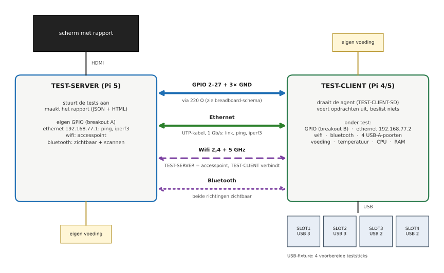
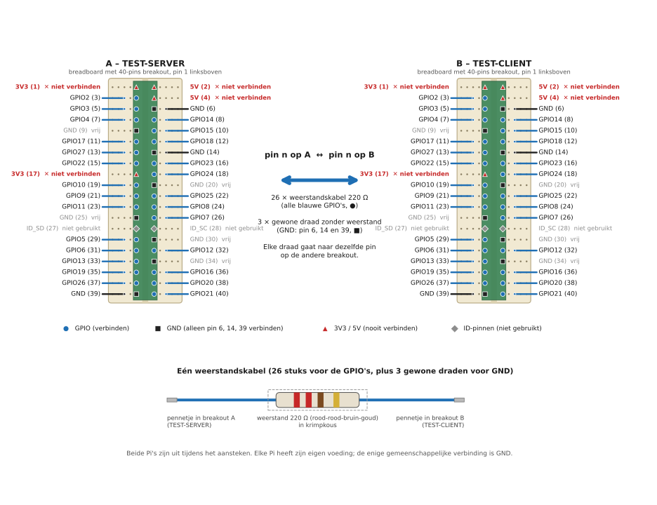

# Opstelling: TEST-SERVER + TEST-CLIENT (breadboard)



*De afbeeldingen worden gegenereerd door `docs/diagrams/maak_schemas.py`. Pas dat script aan, niet de SVG's.*

## Onderdelen

| Aantal | Onderdeel | Opmerking |
|---|---|---|
| 2 | 40-pins GPIO-breakout voor breadboard ("cobbler") + lintkabel | één per Pi; controleer waar pin 1 zit |
| 2 | breadboard | één per breakout; de breakouts hoeven alleen de pinnen te dragen |
| 26 | weerstand 220 Ω | zie "Weerstandskabels" hieronder |
| 29 | male-male dupontdraad, ca. 20 cm | 26 worden weerstandskabels, 3 blijven gewone GND-draden |
| 26 | stukjes krimpkous | over de soldeerverbinding van de weerstandskabel |
| 1 | UTP-kabel | direct tussen beide Pi's, geen switch |
| 2 | voeding per Pi (5 V / 3 A voor Pi 4, 5 V / 5 A voor Pi 5) | elke Pi zijn eigen voeding |
| 1 | multimeter | voor de controle voor de eerste keer opstarten |
| 1 | soldeerbout | voor de 26 weerstandskabels |

## Veiligheidsregels

1. **Verbind nooit 3V3 of 5V tussen de twee Pi's.** Dat zijn de headerpinnen 1, 2, 4 en 17. Twee voedingen tegen elkaar kunnen een Pi kapotmaken. Enkel GND en de 26 GPIO's gaan over.
2. **Elke GPIO-lijn loopt via een weerstand van 220 Ω.** Zo blijft de stroom bij een softwarefout of een defecte pin beperkt tot ongeveer 15 mA (3,3 V / 220 Ω).
3. **Steek de GPIO-kabel alleen in of uit als beide Pi's uit staan.**
4. **Geen HAT's of andere hardware** op de header van de TEST-CLIENT tijdens de test.
5. GPIO0 en GPIO1 (pin 27 en 28, HAT-EEPROM) worden niet getest en niet verbonden.

## Bedrading



Verbind elke GPIO-pin op breakout A (TEST-SERVER) met **dezelfde** pin op breakout B (TEST-CLIENT), en drie GND-pinnen.

**Weerstandskabels.** Op een breadboard bezet de breakout alle kolommen waarin de pinnen zitten, dus
er is geen vrije plek om een weerstand tussen twee pinnen te zetten. Daarom zit de weerstand in de kabel zelf:

1. Knip een male-male dupontdraad doormidden.
2. Solder een weerstand van 220 Ω tussen de twee helften en schuif er krimpkous over.
3. Maak er 26 en nummer of label ze niet: ze zijn onderling identiek.
4. Steek het ene uiteinde in een vrij gat in de rij van pin *n* op breakout A, het andere in de rij van pin *n* op breakout B.

Voor GND gebruik je 3 gewone dupontdraden (pin 6, 14 en 39), zonder weerstand.

De pinnen waar **geen** kabel naartoe gaat, staan in het schema aangegeven: 3V3 en 5V (rood, nooit), de ID-pinnen
27 en 28 (grijs, niet gebruikt) en de overige GND-pinnen (vrij).

| GPIO | Pin | | GPIO | Pin | | GPIO | Pin |
|---|---|---|---|---|---|---|---|
| 2 | 3 | | 11 | 23 | | 20 | 38 |
| 3 | 5 | | 12 | 32 | | 21 | 40 |
| 4 | 7 | | 13 | 33 | | 22 | 15 |
| 5 | 29 | | 14 | 8 | | 23 | 16 |
| 6 | 31 | | 15 | 10 | | 24 | 18 |
| 7 | 26 | | 16 | 36 | | 25 | 22 |
| 8 | 24 | | 17 | 11 | | 26 | 37 |
| 9 | 21 | | 18 | 12 | | 27 | 13 |
| 10 | 19 | | 19 | 35 | | | |

GND-pinnen: 6, 9, 14, 20, 25, 30, 34, 39. De tabel staat ook in de code (`HEADER_PIN` in `rpitest/gpio/ports.py`), en een test controleert dat hij klopt. Het rapport noemt bij een probleem altijd GPIO-nummer én fysieke pin.

Het rapport noemt een probleem altijd met GPIO-nummer en fysieke pin, zodat je de bijbehorende kabel snel vindt.

## Controle voor het opstarten (beide Pi's uit)

Met de multimeter op doorgangstest:
- Elke GPIO-pin op A heeft doorgang (ca. 220 Ω) met dezelfde pin op B.
- Er is **geen** doorgang tussen twee verschillende GPIO-pinnen, ook niet tussen buurpinnen.
- Er is **geen** verbinding tussen 3V3 (pin 1, 17) of 5V (pin 2, 4) van A en B, en ook niet tussen deze pinnen en een GPIO of GND.
- GND van A heeft doorgang met GND van B.

## Netwerk

Rechtstreekse UTP-kabel tussen de twee ethernetpoorten, zonder crossoverkabel. Vaste adressen:

| | IP |
|---|---|
| TEST-SERVER | 192.168.77.1 |
| TEST-CLIENT | 192.168.77.2 |

Het vaste adres wordt door `install.sh` ingesteld (als laatste stap, via NetworkManager). De adressen staan in
`rpitest/config.py`; de scripts lezen ze daar.

## Software

Alles wordt geïnstalleerd en ingesteld met **één script**: `sudo ./install.sh server` voor de TEST-SERVER en
`sudo ./install.sh client` voor de TEST-CLIENT-SD van de TEST-CLIENT. Het installeert de pakketten, de software, het scherm en de
diensten, zet I2C, SPI en de seriële console uit (die houden GPIO-pinnen bezet), stelt het wifi-land in en zet het
vaste IP-adres. Met `--check` zie je eerst wat er al op de Pi staat.

Het stappenplan staat in de [README](../README.md#installeren-op-een-pi-stappenplan); het draaiboek voor de eerste keer in
[eerste-installatie.md](eerste-installatie.md). Basis is **Raspberry Pi OS Trixie, 64-bit**; Bookworm werkt niet, want die
levert libgpiod 1.x.

De tests starten daarna vanzelf: de TEST-SERVER toont het scherm met de startknop en de TEST-CLIENT draait de agent. Zie [image.md](image.md).

## Netwerk, wifi en bluetooth

| Check | Wat gebeurt er | Wat vraagt het |
|---|---|---|
| `net.link` | linksnelheid en duplex van de ethernetpoort van de TEST-CLIENT (verwacht 1000 Mb/s) | gigabitpoort op de TEST-SERVER, goede kabel |
| `net.latency` | 20 pings in beide richtingen: geen verlies, gem. RTT onder 2 ms | |
| `net.throughput` | `iperf3` 5 s in beide richtingen: PASS vanaf 800 Mb/s, WARN vanaf 500 | `iperf3` op beide Pi's |
| `net.errors` | rx/tx/CRC-fouten die tijdens de test bijkomen | |
| `wifi.radio` | TEST-CLIENT heeft een wifi-interface en geen hardware-rfkill | |
| `wifi.2.4GHz`, `wifi.5GHz` | TEST-SERVER start een accesspoint (NetworkManager-hotspot, kanaal 6 en 36); de TEST-CLIENT scant, verbindt, krijgt een IP, pingt beide richtingen; signaalsterkte | wifi op de TEST-SERVER, wifi-land ingesteld op beide Pi's |
| `bt.controller` | TEST-CLIENT heeft een ingeschakelde bluetooth-controller | |
| `bt.receive` | TEST-SERVER is zichtbaar, TEST-CLIENT moet hem zien | `bluez` op beide Pi's |
| `bt.transmit` | TEST-CLIENT is zichtbaar, TEST-SERVER moet hem zien | |

Aandachtspunten:
- **Wifi-land** staat op beide Pi's op `BE` (door `install.sh`; ander land met `WIFI_COUNTRY=<code>`). Zonder land
  kan het accesspoint op 5 GHz niet starten.
- **De TEST-SERVER gebruikt zijn wifi als accesspoint**, en zijn ethernetpoort voor de TEST-CLIENT. Beheer van
  de TEST-SERVER gebeurt dus met toetsenbord en scherm, of met een extra USB-ethernetadapter.
- **Wifi en bluetooth** delen op de Pi dezelfde chip. De bluetooth-test draait daarom na de wifi-test.
- Het wifi-netwerk `RPITEST` en het wachtwoord staan in `rpitest/config.py`. Het is een wegwerpnetwerk
  dat alleen tijdens de test bestaat; het wachtwoord is geen geheim.
- Als de TEST-SERVER geen wifi of bluetooth heeft, staan die checks op **SKIP** en wordt het eindoordeel
  **INCOMPLETE**, niet PASS.
- Alle drempelwaarden staan in `rpitest/config.py`. Het zijn eerste schattingen; stel ze bij met een bekend goede Pi.

## USB

Software kan niet weten of een USB-poort werkt als er niets in zit. Daarom gebruiken we een
**fixture met vier voorbereide teststicks** die tegelijk in de vier USB-A-poorten van de TEST-CLIENT zitten.

**Onderdelen:** vier sticks van minstens 1 GB. Twee moeten echte USB 3-sticks zijn (voor de blauwe
poorten), twee mogen USB 2 zijn. Ze moeten naast elkaar in de gestapelde poorten passen: gebruik
smalle sticks of korte USB-verlengkabels, bevestigd in een blok of plank zodat de TEST-CLIENT er telkens
op dezelfde manier aan gekoppeld wordt.

**Sticks voorbereiden** (op een Linux-pc of de TEST-SERVER, één keer per stick):
```
sudo .venv/bin/python -m rpitest.usbtools scan                              # welk /dev/sdX is mijn stick?
sudo .venv/bin/python -m rpitest.usbtools prepare /dev/sdX --label SLOT1    # toont wat er gewist wordt
sudo .venv/bin/python -m rpitest.usbtools prepare /dev/sdX --label SLOT1 --yes
```
Gebruik `SLOT1` en `SLOT2` voor de USB 3-sticks in de blauwe poorten, `SLOT3` en `SLOT4` voor de
USB 2-poorten. **`prepare` overschrijft sector 0 (partitietabel) van de stick.** Gebruik hem alleen op
sticks die uitsluitend teststick zijn. Het commando weigert partities, schijven die geen USB zijn, schijven
groter dan 256 GiB en gekoppelde (mounted) apparaten.

**Wat getest wordt** (`usb.*`):

| Check | Wat gebeurt er |
|---|---|
| `usb.SLOT1` tot `usb.SLOT4` | stick gevonden; onderhandelde snelheid (5000 Mb/s op de blauwe poorten, 480 op de zwarte); 32 MB schrijven, terugleggen en vergelijken met een checksum; leessnelheid |
| `usb.kernel` | `dmesg` na overstroom (over-current), mislukte enumeratie en xHCI-fouten sinds het opstarten; USB-disconnects en -resets tijdens de test |
| `usb.fixture` | verschijnt alleen als er geen enkele teststick gevonden wordt: fixture niet aangesloten, of de USB-controller is defect |

**Veiligheid:** de test schrijft alleen naar een apparaat waarvan sector 0 onze header bevat, en
alleen in een testgebied vanaf 16 MB. Een stick van een student die toevallig in de TEST-CLIENT zit, heeft die
header niet en wordt niet aangeraakt. Alleen `/dev/sdX`-apparaten die aan USB hangen worden geaccepteerd.

**Poorten benoemen:** de namen en drempels per slot staan in `USB_SLOTS` in `rpitest/config.py`.
Een ander fixture-indeling kan met `python -m rpitest --usb-fixture slots.json`, met een lijst van dezelfde
velden (`label`, `name`, `min_speed_mbit`, `min_read_mb_s`).

**Beperkingen:** stroomverbruik per poort wordt niet gemeten. Overstroom blijkt alleen uit het kernellogboek.
De poort van de USB-C-voeding wordt niet getest.

## Voeding en temperatuur

De TEST-CLIENT draait ca. een minuut met alle kernen op een rekentaak en een geheugentest. Intussen leest
de TEST-SERVER elke 2 seconden temperatuur, klokfrequentie en de `throttled`-vlaggen van de firmware uit.
Dit komt als laatste in de run, zodat onderspanning uit de eerdere tests ook in de historie zit.

| Check | Wat gebeurt er | Uitkomst |
|---|---|---|
| `power.sensors` | temperatuur, frequentie en `vcgencmd get_throttled` leesbaar | FAIL zonder temperatuur of frequentie; WARN zonder `get_throttled` |
| `power.supply` | onderspanning tijdens de belasting; op de Pi 5 ook de gemeten ingangsspanning (`vcgencmd pmic_read_adc`) | FAIL bij onderspanning nu; WARN bij een spanning onder 4,75 V of onderspanning alleen sinds het opstarten |
| `power.thermal` | rusttemperatuur, piek en laagste klokfrequentie | FAIL vanaf 85 °C; WARN bij throttling, vanaf 80 °C of al 60 °C in rust |
| `power.cpu` | alle kernen actief (4) en een vaste SHA-256-keten geeft overal hetzelfde resultaat | FAIL bij een ontbrekende kern of verkeerde uitkomsten; WARN bij een veel tragere kern |
| `power.memory` | 256 MB (max. de helft van het vrije geheugen) met vaste en adresafhankelijke patronen | FAIL bij fout teruggelezen blokken |

Aandachtspunten:
- **De voeding van de TEST-CLIENT telt mee.** Gebruik een goede voeding (Pi 4: 5,1 V / 3 A; Pi 5: 5 V / 5 A of de
  officiële 27 W) en bevestig met de zelftest op een bekend goede Pi dat die geen onderspanning geeft.
  Een TEST-CLIENT met een slechte stroomingang valt dan door zijn eigen spanning af.
- **Koeling is bepalend voor de temperatuur.** Een Pi zonder koelblok throttlet snel; dat is geen defect,
  en daarom geeft throttling een WARN en geen FAIL. Laat een ventilator over de TEST-CLIENT blazen, zodat de
  metingen vergelijkbaar blijven.
- De geheugentest is een korte controle in Python, geen vervanger van `memtester`. Zeldzame geheugenfouten
  vind je er niet mee.
- Duur en drempels staan in `rpitest/config.py` (`STRESS_SECONDS`, `TEMP_*`, `MIN_5V_VOLT`).

## Eerste keer: wat nog bevestigd moet worden

Dit is geschreven zonder echte hardware. Controleer bij de eerste run:

1. **Chiplabels.** `--list-chips` moet op de Pi 5 een chip met label `pinctrl-rp1` (54 lijnen) tonen, en op de Pi 4 `pinctrl-bcm2711`. Wijkt het af, pas dan `HEADER_CHIP_LABELS` in `rpitest/gpio/real.py` aan.
2. **Zelftest met een bekend goede TEST-CLIENT.** Laat de test eerst draaien met een Pi waarvan je weet dat hij werkt. Een fout dan wijst op de bedrading of de TEST-SERVER. Los die eerst op, voor je de eerste echte student-Pi test.
3. **GPIO2 en GPIO3.** Beide kanten hebben een vaste pull-up van 1,8 kΩ. Een lage stand komt via 220 Ω tegen één van die pull-ups uit, wat ongeveer 0,4 V geeft. Dat hoort ruim onder de drempel te liggen; controleer dat deze twee pinnen slagen.
4. **Uitvoerformaten van de tools.** De parsers voor `ping`, `iperf3`, `nmcli`, `iw` en `bluetoothctl`
   zijn geschreven op basis van het formaat dat ik me herinner. Het rapport bewaart de ruwe gegevens
   per check in de JSON; controleer ze bij de eerste run. Zijn ze anders, stuur me dan de uitvoer, dan
   pas ik de parsers en de voorbeelden in `tests/test_parsers.py` aan.
5. **Bluetooth zichtbaar maken.** De TEST-SERVER blijft zichtbaar zolang een `bluetoothctl`-sessie openstaat.
   Dat werkt volgens mijn kennis, maar is niet getest.
6. **Hotspot op 5 GHz.** Controleer dat `nmcli dev wifi hotspot ... band a channel 36` op de TEST-SERVER werkt.
7. **USB.** Controleer drie dingen:
   - dat `usbtools scan` je sticks toont met het juiste label na `prepare`;
   - dat de onderhandelde snelheid op de blauwe poorten echt 5000 Mb/s is met USB 3-sticks. Zo niet, kijk dan of de stick of de poort het probleem is;
   - dat de leesdrempels (60 en 15 MB/s) bij jouw sticks haalbaar zijn. Pas ze aan op basis van de gemeten waarden in het rapport van een bekend goede Pi.

   De opslagtest gebruikt `O_DIRECT` op het blokapparaat, en alleen op een gewoon bestand zonder `O_DIRECT` is hij getest. Meld het als dat op de echte stick een foutmelding geeft.
8. **Voeding en temperatuur.** Controleer dat `vcgencmd get_throttled` en `vcgencmd pmic_read_adc` werken
   (pakket `libraspberrypi-bin`), en of de regel `EXT5V_V` in het formaat staat dat de parser verwacht. Zo niet, dan
   ontbreekt de spanningsmeting stil en blijft het bij de `throttled`-vlag. De drempels voor temperatuur en
   frequentie zijn schattingen; kijk wat een bekend goede Pi in jouw opstelling haalt.
9. **Pull-up/-down testen** (`gpio.pulls`): zwevende lijnen kunnen op echte hardware afwijken van de simulatie. Slagen alle pinnen, dan is dat goed. Zo niet, noteer dan welke.
