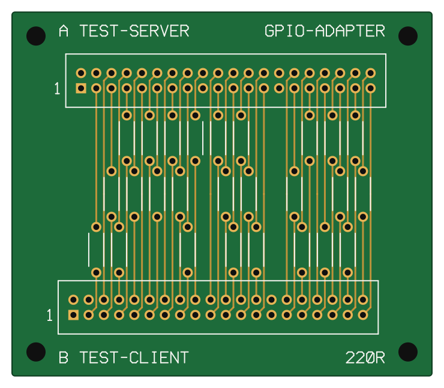

# GPIO-adapter als print (PCB)

Dit is een alternatief voor de breadboards en de 26 zelfgesoldeerde weerstandskabels uit [opstelling.md](opstelling.md#bedrading):
één kleine print met twee headers en de 26 weerstanden erop. Elke Pi krijgt een lintkabel naar zijn eigen header. De
veiligheidsregels en de manier van testen blijven gelijk; alleen de bedrading is vervangen.



*Ontwerp en bestanden staan in `hardware/gpio-adapter/`. Ze worden gegenereerd door `hardware/gpio-adapter/maak_pcb.py`; pas
dat script aan, niet de uitvoer.*

## Wat de print doet

- Pin *n* van header **J1** (TEST-SERVER, boven) is verbonden met pin *n* van header **J2** (TEST-CLIENT, onder).
- Elk van de **26 GPIO-lijnen** loopt via een weerstand van **220 Ω** (R2 tot en met R27; het nummer is het GPIO-nummer).
- De **8 GND-pinnen** (6, 9, 14, 20, 25, 30, 34, 39) zijn rechtstreeks doorverbonden. Dat zijn er meer dan de drie draden
  uit de breadboardopstelling, wat een lagere massaweerstand geeft en de print niet ingewikkelder maakt.
- **3V3 (pin 1, 17), 5V (pin 2, 4) en de ID-pinnen (27, 28) zijn nergens mee verbonden.** Er loopt dus geen enkele baan waarlangs
  twee voedingen elkaar kunnen raken. Dat staat ook in de tests (`tests/test_pcb.py`).
- Afmetingen: 70 × 60,8 mm, vier M3-gaten in de hoeken, **één koperlaag**.

## Hoe dit met één laag lukt

Alle verbindingen zijn rechte, verticale banen van J1 naar J2; er kruist niets en er zijn geen draadbruggen nodig. Dat kan omdat
J2 **1,27 mm naar links** staat ten opzichte van J1: de buitenste pinrij van elke header komt via een 45°-hoekje door de ruimte
tussen twee binnenste pinnen, waarna de baan precies op de plek van de pin aan de overkant uitkomt. De banen liggen 1,27 mm uit
elkaar, een weerstand is 2,5 mm breed; daarom staan de weerstanden verdeeld over drie niveaus (de plaats van de baan modulo 3).
Het weerstandslichaam ligt tussen de twee pads op zijn eigen baan.

## Pinnummering van de headers (let op)

Beide headers staan met de lange kant horizontaal, **pin 1 links onderaan** (het vierkante pad, met een "1" ernaast op de
zeefdruk). Pin 2 ligt boven pin 1, zoals op de GPIO-header van een Pi: de bovenste rij heeft de even pinnen, de onderste de
oneven. Zo komt elke GPIO-lijn bij een correcte connector op de goede pin uit. Is de nummering gespiegeld, dan zou een
GPIO-lijn op een 5V-pin uitkomen; de tests controleren dat deze print dat niet doet, maar daarom geldt bij het solderen:
**pin 1 van de header op het vierkante pad.**

## Onderdelen

Zie `hardware/gpio-adapter/bom.csv`.

| Aantal | Onderdeel | Opmerking |
|---|---|---|
| 1 | de print (`gpio-adapter-gerber.zip`) | zie "Laten maken" |
| 26 | weerstand 220 Ω, 0,25 W, axiaal (DIN0207), steek 7,62 mm | R2 tot en met R27 |
| 2 | boxheader (shrouded IDC) 2×20, 2,54 mm, recht, soldeer | J1 en J2; de behuizing is 53,3 × 8,9 mm |
| 2 | 40-polige lintkabel met twee IDC-connectoren, 1:1 | één per Pi; niet kruisen of draaien |
| 4 | M3-afstandsbusje of schroef | optioneel |

## Laten maken

1. Upload `hardware/gpio-adapter/gpio-adapter-gerber.zip` bij een printfabrikant en kies **1 laag**, 1,6 mm FR4, HASL of OSP.
2. Het koper zit op de **onderkant (B.Cu)**, de onderdelen komen aan de bovenkant; alle gaten zijn niet-doormetalliseerd. Controleer
   in de Gerber-viewer van de fabrikant dat de banen aan de soldeerzijde zitten en dat de zeefdruk aan de componentenzijde staat.
3. De kleinste maten zijn banen van 0,3 mm en een afstand van minstens 0,2 mm tussen koper van verschillende netten; dat kan elke
   standaardfabrikant.

**Hoe zeker is dit ontwerp?** De verbindingen, de afstanden en de passing van de onderdelen worden in `tests/test_pcb.py` gecontroleerd
op de Gerber- en boorbestanden zelf. Het bord is nog niet gemaakt, en het KiCad-bestand (`kicad/gpio-adapter.kicad_pcb`) is gegenereerd
maar niet in KiCad zelf geopend. Bestel eerst een klein aantal en doe de controle hieronder voordat je een Pi aansluit.

## Bouwen

1. Soldeer de 26 weerstanden (alle even groot, geen richting). Ze liggen langs de baan; de zeefdruk toont hun lichaam.
2. Soldeer de twee boxheaders, **pin 1 op het vierkante pad**. De uitsparing van de behuizing komt vanzelf aan de goede kant.
3. Steek de lintkabels erin met de rode streep bij pin 1, en aan de Pi-kant bij pin 1 van de GPIO-header (de pin met 3V3, het vierkante pad op de Pi). Steek de kabels alleen in of uit als beide Pi's uit staan.

## Controle voor het opstarten (kabels niet aangesloten, multimeter)

- Elke GPIO-pin van J1 heeft doorgang met dezelfde pin van J2, met ca. 220 Ω. Het GPIO-nummer bij een pin staat in [opstelling.md](opstelling.md#bedrading).
- Er is **geen** doorgang tussen twee verschillende GPIO-pinnen, ook niet tussen buurpinnen.
- Elke GND-pin van J1 heeft doorgang (0 Ω) met dezelfde GND-pin van J2.
- Pin 1, 2, 4 en 17 van J1 en J2 hebben **geen** doorgang met wat dan ook, ook niet met een GPIO of GND. Doet er een wel, dan is de
  print of de header verkeerd, en mag er geen Pi op.

## Het ontwerp aanpassen

```
python hardware/gpio-adapter/maak_pcb.py           # schrijft de Gerber-, boor-, KiCad-, BOM- en SVG-bestanden opnieuw
python hardware/gpio-adapter/maak_pcb.py --check   # controleert of de bestanden in de repo nog bij het script horen
python -m pytest tests/test_pcb.py
```

De pinindeling komt uit `rpitest/gpio/ports.py`, dus een wijziging daar wordt hier ook zichtbaar.
